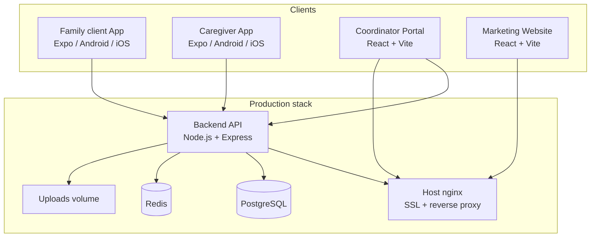

# HappyHands Elders

**ElderCare** is an eldercare marketplace built for India. Family clients discover and book verified caregivers; coordinators onboard and verify staff in the field; caregivers manage schedules, GPS tracking, time entries, and earnings through a dedicated mobile app.

This monorepo contains the full product stack:

| Component | Folder | Tech |
|-----------|--------|------|
| REST API | `Backend/` | Node.js 20, Express 5, Prisma, PostgreSQL, Redis |
| Coordinator portal | `Agent/onboarding-agent-web/` | React 19, Vite 8, Tailwind CSS 4 |
| Family app | `Family App/family-app/` | Expo 54, React Native 0.81 |
| Caregiver app | `Caregiver App/caregiver-app/` | Expo 54, React Native 0.81 |
| Deploy | `deploy/`, `docker-compose.yml` | Docker Compose + host nginx |

**Repository:** [github.com/CodefirstTechnology/HappyHands-Elders](https://github.com/CodefirstTechnology/HappyHands-Elders)

---

## Table of contents

1. [Quick start (local)](#quick-start-local)
2. [Architecture](#architecture)
3. [User roles & flows](#user-roles--flows)
4. [Monorepo structure](#monorepo-structure)
5. [Backend API](#backend-api)
6. [Coordinator portal](#coordinator-portal)
7. [Family app (mobile)](#parent-app-mobile)
8. [Caregiver app (mobile)](#caregiver-app-mobile)
9. [Marketing website](#marketing-website)
10. [Environment variables & secrets](#environment-variables--secrets)
11. [Production deployment](#production-deployment)
12. [Business rules](#business-rules)
13. [UI & design](#ui--design)
14. [Troubleshooting](#troubleshooting)
15. [Per-project READMEs](#per-project-readmes)

---

## Quick start (local)

Run these in order on a machine with **Node.js 20+**, **PostgreSQL 16+**, and **Redis 7+**.

### 1. Database & Redis (Docker option)

```bash
docker run -d --name eldercare-pg \
  -e POSTGRES_PASSWORD=password -e POSTGRES_DB=Eldercare_db \
  -p 5432:5432 postgres:16-alpine

docker run -d --name eldercare-redis -p 6379:6379 redis:7-alpine
```

### 2. Backend API

```bash
cd Backend
cp .env.example .env          # Edit DATABASE_URL, JWT secrets, etc.
npm install
npx prisma db push
npx prisma generate
node prisma/seed.js           # Admin, coordinator, skills
npm run dev                   # http://localhost:5000
```

Health: `GET http://localhost:5000/health`

### 3. Coordinator portal

```bash
cd Agent/onboarding-agent-web
cp .env.example .env          # VITE_API_BASE_URL=http://localhost:5000/api/v1
npm install
npm run dev                   # http://localhost:5173
```

Login: `coordinator@eldercare.com` / `ElderCare@123` (or admin account below).

### 4. Mobile apps

```bash
# Family app
cd "Family App/family-app"
cp .env.example .env
npm install && npx expo install
npm start

# Caregiver app (separate terminal)
cd Caregiver App/caregiver-app
cp .env.example .env
npm install && npx expo install
npm start
```

On a **physical phone**, set `EXPO_PUBLIC_API_BASE_URL` to your PC's LAN IP (from `ipconfig`), not `localhost`. Restart Expo with `npx expo start -c` after changing `.env`.

Open the workspace in VS Code/Cursor: `HappyHandsElders.code-workspace`.

---

## Architecture



| Layer | Technology |
|-------|------------|
| API | Node.js 20, Express 5, Prisma 5, PostgreSQL 16, Redis 7, BullMQ |
| Coordinator portal | React 19, Vite 8, React Router 7, TanStack Query, Tailwind CSS 4 |
| Mobile apps | Expo 54, expo-router 6, React Native 0.81, TanStack Query, Zustand, i18next |
| Auth | JWT access (15m) + refresh (7d), bcrypt passwords |
| Maps & geo | Google Maps / Places / Geocoding |
| KYC | UIDAI Aadhaar offline XML verification |
| SMS | MSG91 or Twilio (care-start OTP to family clients) |
| Deploy | Docker Compose + host nginx + Let's Encrypt |

---

## User roles & flows

| Role | ID | How they join | Primary surface |
|------|----|---------------|-----------------|
| **Admin** | 1 | Seeded | Coordinator portal → `/admin` |
| **Coordinator** | 2 | Created by admin or seeded | Coordinator portal |
| **Caregiver** | 3 | Onboarded by coordinator (primary) or self-register (pending) | Caregiver app |
| **Parent** | 4 | Self-register in family app | Family app |

### Default seeded accounts

| Role | Email | Password |
|------|-------|----------|
| Admin | `admin@eldercare.com` | `ElderCare@123` |
| Coordinator | `coordinator@eldercare.com` | `ElderCare@123` |

Family clients register via `POST /api/v1/auth/register-parent`. Caregivers are created by coordinators; default onboarding password in the portal form is `Caregiver@123` unless changed.

### Typical journey

1. **Coordinator** logs into the portal and creates a caregiver (photo, ID proof, skills, rates, zones).
2. **Coordinator** verifies the caregiver → status `VERIFIED` (optionally after Aadhaar XML KYC).
3. **Parent** registers, browses verified caregivers, books **MONTHLY** (recurring) or **SESSION** (one-off).
4. **Booking:** direct (pick caregiver) or **open area** (nearby caregivers notified, race to accept).
5. **Caregiver** confirms → marks **arrived** → verifies **care-start OTP** (SMS to parent).
6. **Caregiver** clocks in/out; booking completes; **parent** leaves a review with **child safety rating**.

---

## Monorepo structure

```
HappyHands-Elders/
├── Backend/                         # REST API, Prisma, uploads
│   ├── prisma/                      # Schema + migrations + seed
│   ├── src/                         # Express app (controllers, routes, services)
│   └── certs/                       # UIDAI public certificates (Aadhaar KYC)
├── Agent/
│   └── onboarding-agent-web/        # Coordinator + admin web portal
├── Family App/
│   └── family-app/                  # Expo family client app
├── Caregiver App/
│   └── caregiver-app/               # Expo caregiver app
├── deploy/
│   ├── nginx/eldercare.conf         # Host nginx template
│   └── scripts/deploy.sh            # Production deploy helper
├── scripts/
│   ├── check-no-secrets.js          # Pre-commit secret scanner
│   └── restore-from-transcript.js   # Dev utility
├── .githooks/pre-commit             # Runs secret check on commit
├── docker-compose.yml               # Production Docker stack
├── .env.production.example          # VPS env template
├── HappyHandsElders.code-workspace          # VS Code multi-root workspace
└── README.md                        # This file
```

| App | Path | Default dev URL |
|-----|------|-----------------|
| Backend API | `Backend/` | `http://localhost:5000/api/v1` |
| Coordinator portal | `Agent/onboarding-agent-web/` | `http://localhost:5173` |
| Family app | `Family App/family-app/` | Expo dev server |
| Caregiver app | `Caregiver App/caregiver-app/` | Expo dev server |

> **Note:** Some internal filenames still use legacy names (`servant`, `house-owner`). User-facing copy and API routes use **caregiver** and **parent**.

---

## Backend API

See [`Backend/README.md`](Backend/README.md) for full backend documentation.

### Prerequisites

- Node.js 20+
- PostgreSQL 16+
- Redis 7+

### NPM scripts

```bash
npm start              # Production server
npm run dev            # nodemon hot reload
npm run seed           # Roles, admin, coordinator, skills
npm run seed:caregivers # Additional caregiver test data
```

### API route map

All routes prefixed with `/api/v1`.

#### Authentication — `/auth`

| Method | Path | Auth | Description |
|--------|------|------|-------------|
| POST | `/register-parent` | — | Family client signup |
| POST | `/register-caregiver` | — | Self-registration (pending review) |
| POST | `/login` | — | Email/password login |
| POST | `/refresh` | — | Refresh access token |
| POST | `/logout` | Bearer | Invalidate refresh token |
| GET | `/me` | Bearer | Current user profile |
| PATCH | `/me/location` | Bearer | Update user location |
| PATCH | `/me/preferences` | Bearer | Language & preferences |
| POST | `/forgot-password` | — | Password reset email |
| POST | `/reset-password` | — | Reset with token |

#### Caregivers — `/caregivers`

| Method | Path | Role | Description |
|--------|------|------|-------------|
| GET | `/` | PARENT | List verified caregivers |
| GET | `/me` | CAREGIVER | Own profile |
| PATCH | `/me` | CAREGIVER | Update own profile |
| GET | `/me/schedule` | CAREGIVER | Upcoming bookings |
| GET | `/me/time-entries` | CAREGIVER | Time entry history |
| GET | `/:id` | Authenticated | Caregiver detail |

#### Bookings — `/bookings`

| Method | Path | Role | Description |
|--------|------|------|-------------|
| POST | `/` | PARENT | Create booking (direct or open area) |
| GET | `/` | Any | List own bookings |
| GET | `/open-requests` | CAREGIVER | Pending area requests |
| GET | `/:id` | Any | Booking detail |
| GET | `/:id/tracking` | Any | Live caregiver GPS |
| POST | `/:id/tracking` | CAREGIVER | Push GPS updates |
| PATCH | `/:id/confirm` | CAREGIVER | Accept booking |
| PATCH | `/:id/reject` | CAREGIVER | Reject with reason |
| PATCH | `/:id/arrived` | CAREGIVER | Arrived at home |
| POST | `/:id/verify-work-otp` | CAREGIVER | Verify care-start OTP |
| POST | `/:id/resend-work-otp` | CAREGIVER | Resend OTP SMS |
| PATCH | `/:id/cancel` | PARENT | Cancel booking |
| PATCH | `/:id/complete` | Any | Mark completed |
| POST | `/:id/review` | PARENT | Rate completed booking |

**Booking types:** `MONTHLY` | `SESSION`  
**Statuses:** `PENDING` → `CONFIRMED` → `ARRIVED` → `OTP_PENDING` → `ACTIVE` → `COMPLETED` (or `CANCELLED` / `REJECTED` / `EXPIRED`)

#### Coordinator — `/coordinator` (COORDINATOR or ADMIN)

| Method | Path | Description |
|--------|------|-------------|
| GET | `/stats` | Dashboard metrics |
| PATCH | `/profile` | Agency name, location, service radius |
| POST | `/caregivers` | Onboard caregiver (multipart: photo + ID) |
| GET | `/caregivers` | List onboarded caregivers |
| GET | `/caregivers/:id` | Caregiver detail |
| PATCH | `/caregivers/:id` | Update caregiver |
| PATCH | `/caregivers/:id/password` | Set caregiver login password |
| PATCH | `/caregivers/:id/verify` | Approve/reject verification |
| POST | `/caregivers/:id/upload-id` | Upload ID proof |
| GET/POST/PATCH/DELETE | `/caregivers/:id/zones` | Service zones |

#### Admin — `/admin` (ADMIN only)

| Method | Path | Description |
|--------|------|-------------|
| GET | `/stats` | Platform overview |
| GET | `/users` | All users |
| PATCH | `/users/:id/toggle` | Enable/disable user |
| GET | `/bookings` | All bookings |
| GET | `/caregivers` | All caregivers |
| GET/POST/PATCH | `/coordinators` | Manage coordinators |
| GET/POST/PATCH/DELETE | `/skills` | Skill catalog |

#### Other routes

| Prefix | Description |
|--------|-------------|
| `/skills` | Public skill list |
| `/time` | Caregiver clock-in/out |
| `/zones` | Caregiver zones (`GET /me`) |
| `/geo` | Places autocomplete, geocode, map preview |
| `/kyc` | Aadhaar offline XML upload & verification |
| `/notifications` | In-app notifications |

### Database (Prisma)

Schema: `Backend/prisma/schema.prisma`

Core models: `User`, `Role`, `Parent`, `Caregiver`, `Coordinator`, `Booking`, `TimeEntry`, `Review`, `Zone`, `Skill`, `Notification`, `BookingWorkStartOtp`, `RefreshToken`.

Key enums: `VerificationStatus`, `BookingType`, `BookingStatus`, `CaregiverRegistrationSource`.

### File uploads

ID proofs and profile photos stored under `Backend/uploads/` (configurable via `UPLOAD_DIR`). Served at `GET /uploads/<filename>`.

---

## Coordinator portal

See [`Agent/onboarding-agent-web/README.md`](Agent/onboarding-agent-web/README.md).

React SPA for field coordinators and platform admins.

### Stack

React 19 · Vite 8 · React Router 7 · TanStack Query · React Hook Form + Zod · Tailwind CSS 4 · Axios

### Local setup

```bash
cd Agent/onboarding-agent-web
cp .env.example .env
npm install
npm run dev
```

Set `VITE_API_BASE_URL=http://localhost:5000/api/v1` in `.env`.

### Routes

| Path | Role | Feature |
|------|------|---------|
| `/login` | — | Login |
| `/` | COORDINATOR, ADMIN | Dashboard |
| `/registrations` | COORDINATOR, ADMIN | Self-registered caregivers pending review |
| `/caregivers` | COORDINATOR, ADMIN | Caregiver list |
| `/caregivers/new` | COORDINATOR, ADMIN | Onboard new caregiver |
| `/caregivers/:id` | COORDINATOR, ADMIN | Detail & verification |
| `/caregivers/:id/edit` | COORDINATOR, ADMIN | Edit profile |
| `/profile` | COORDINATOR, ADMIN | Agency profile & service radius |
| `/admin` | ADMIN | Admin dashboard |
| `/admin/agents` | ADMIN | Manage coordinators |
| `/admin/users` | ADMIN | User management |
| `/admin/bookings` | ADMIN | All bookings |
| `/admin/caregivers` | ADMIN | All caregivers |
| `/admin/skills` | ADMIN | Skill catalog CRUD |

### Production build

```bash
npm run build    # dist/
npm run preview  # Local preview
```

Docker: `Agent/onboarding-agent-web/Dockerfile` (nginx serves static files).

---

## Family app (mobile)

See [`Family App/family-app/README.md`](House%20Owner%20App/house-owner-app/README.md).

Expo app for family clients: browse caregivers, book sessions, live tracking, work-start OTP, reviews.

### Stack

Expo SDK 54 · expo-router 6 · React Native 0.81 · TanStack Query · Zustand · react-native-maps · i18next (EN / HI / MR) · expo-secure-store · expo-location

### Local setup

```bash
cd "Family App/family-app"
cp .env.example .env
npm install && npx expo install
npm start
```

### Screens (expo-router)

| Screen | Path | Description |
|--------|------|-------------|
| Home | `(main)/home` | Dashboard |
| Browse | `(main)/browse` | Search verified caregivers |
| Caregiver detail | `(main)/browse/[id]` | Profile, book CTA |
| Bookings | `(main)/bookings` | Active & past |
| New booking | `(main)/bookings/new` | Monthly or session |
| Open request | `(main)/bookings/request` | Area-wide request |
| Booking detail | `(main)/bookings/[id]` | Status, map, OTP |
| Profile | `(main)/profile` | Account, address, language |
| Notifications | `(main)/notifications` | Alerts |
| Auth | `(auth)/login`, `(auth)/register` | Sign in / sign up |

### Release (EAS)

```bash
npm run eas:env:push              # Push .env to EAS preview
npm run eas:env:push:production   # Push .env to EAS production
npm run build:apk                 # Android APK (preview profile)
```

Production API URL example:

```bash
EXPO_PUBLIC_API_BASE_URL=https://api.yourdomain.com/api/v1
```

---

## Caregiver app (mobile)

See [`Caregiver App/caregiver-app/README.md`](Caregiver App/caregiver-app/README.md).

Expo app for onboarded caregivers: schedules, open requests, time tracking, GPS, Aadhaar KYC, earnings.

### Stack

Same core as family app, plus expo-notifications, expo-haptics, expo-document-picker (Aadhaar ZIP).

### Local setup

```bash
cd Caregiver App/caregiver-app
cp .env.example .env
npm install && npx expo install
npm start
```

**Caregivers cannot log in** until a coordinator creates their account in the portal and sets a password.

Native Android with maps: `npm run android` (`expo run:android`).

### Screens

| Screen | Path | Description |
|--------|------|-------------|
| Home | `(main)/home` | Today, open requests |
| Schedule | `(main)/schedule` | Bookings |
| Booking detail | `(main)/schedule/[id]` | Accept, navigate, OTP |
| Time | `(main)/time` | Clock in/out |
| Time history | `(main)/time/history` | Past entries |
| Earnings | `(main)/earnings` | Income summary |
| Profile | `(main)/profile` | Rates, bank details |
| Zones | `(main)/zones` | Service areas |
| Notifications | `(main)/notifications` | Job alerts |
| Auth | `(auth)/login`, `(auth)/register` | Login / optional self-register |

Open booking requests trigger vibration + push notifications when they match the caregiver's zones and skills.

---

## Marketing website

Production Docker Compose includes a **website** service built from `ElderCare_website/` (port `15001`). This folder is **not included in the repo yet** — add or clone your marketing site there before running the full stack.

Build args (from `.env.production.example`):

- `VITE_PARENT_APP_URL`, `VITE_CAREGIVER_APP_URL`
- `VITE_COORDINATOR_PORTAL_URL`
- `VITE_PLAY_STORE_*`, `VITE_APP_STORE_*`

You can deploy API + coordinator portal without the website by commenting out the `website` service in `docker-compose.yml`.

---

## Environment variables & secrets

### Never commit real API keys

| Safe in git | Never commit |
|-------------|--------------|
| `.env.example` | `.env` |
| `.env.production.example` | Any file with real keys |

Real secrets live only in local `.env` files (gitignored):

- `Backend/.env`
- `Agent/onboarding-agent-web/.env`
- `Family App/family-app/.env`
- `Caregiver App/caregiver-app/.env`

### Pre-commit secret check

```bash
node scripts/check-no-secrets.js   # Manual scan of staged files
git config core.hooksPath .githooks   # Enable automatic check on commit
```

### Backend (`Backend/.env`)

| Variable | Required | Description |
|----------|----------|-------------|
| `DATABASE_URL` | Yes | PostgreSQL connection string |
| `JWT_SECRET` | Yes | Min 32 characters |
| `JWT_REFRESH_SECRET` | Yes | Min 32 characters |
| `REDIS_URL` | Yes | Redis URL |
| `CLIENT_URL` | Dev | Comma-separated CORS origins |
| `GOOGLE_MAPS_API_KEY` | Maps | Places, geocoding, static maps |
| `GOOGLE_MAP_ID` | Optional | Styled map tiles |
| `UPLOAD_DIR` | Optional | Default `uploads` |
| `SMS_PROVIDER` | OTP | `log` \| `msg91` \| `twilio` |
| `SMS_ALLOW_DEV_OTP` | Dev | `true` shows OTP in API when SMS is `log` |
| `REQUIRE_AADHAAR_VERIFICATION` | Optional | Default `true` |
| `CAREGIVER_COORDINATOR_RADIUS_KM` | Optional | Default `3` |
| `UIDAI_OFFLINE_CERT_PATH` | KYC | Path to UIDAI public cert |
| `FCM_SERVER_KEY` | Optional | Push notifications |
| `SMTP_*` | Optional | Email (password reset) |
| `MSG91_*` | Prod SMS | MSG91 auth key + DLT template |

Full list: `Backend/.env.example`

### Coordinator portal (`Agent/onboarding-agent-web/.env`)

| Variable | Description |
|----------|-------------|
| `VITE_API_BASE_URL` | API URL including `/api/v1` |
| `VITE_API_HOST` | Optional override for `/uploads` origin |

### Mobile apps (both `.env`)

| Variable | Description |
|----------|-------------|
| `EXPO_PUBLIC_API_BASE_URL` | API URL including `/api/v1` |
| `EXPO_PUBLIC_GOOGLE_MAPS_API_KEY` | Native map tiles |
| `EXPO_PUBLIC_GOOGLE_MAP_ID` | Optional styled maps |
| `EXPO_PUBLIC_USE_GOOGLE_MAP_ID` | `true` only when Map ID works on mobile SDKs |

### Google Maps setup

Use the **same API key** on backend and both mobile apps:

```bash
# Backend/.env
GOOGLE_MAPS_API_KEY=your_key
GOOGLE_MAP_ID=your_map_id

# Both mobile app/.env
EXPO_PUBLIC_GOOGLE_MAPS_API_KEY=your_key
EXPO_PUBLIC_GOOGLE_MAP_ID=your_map_id
```

Enable in Google Cloud Console: **Places API**, **Geocoding API**, **Maps SDK for Android**, **Maps SDK for iOS**. Restrict keys in production.

### Aadhaar KYC

Download UIDAI offline public key to `Backend/certs/` (see `Backend/certs/README.md`). When `REQUIRE_AADHAAR_VERIFICATION=true`, family clients only see Aadhaar-verified caregivers in browse.

### SMS / work-start OTP

Development: `SMS_PROVIDER=log` and `SMS_ALLOW_DEV_OTP=true` — OTP appears in API responses.  
Production (India): `SMS_PROVIDER=msg91` with DLT template; set `SMS_ALLOW_DEV_OTP=false`.

---

## Production deployment

Five Docker services: PostgreSQL, Redis, API, marketing website, coordinator portal. Containers bind to **localhost**; host nginx reverse-proxies with SSL.

### 1. Prepare VPS

```bash
git clone https://github.com/CodefirstTechnology/HappyHands-Elders.git
cd HappyHands-Elders
cp .env.production.example .env
# Edit .env: domains, JWT secrets, POSTGRES_PASSWORD, Maps, SMS
bash deploy/scripts/deploy.sh
```

First-time seed:

```bash
docker compose --env-file .env exec api node prisma/seed.js
```

### 2. Host nginx

Copy `deploy/nginx/eldercare.conf` to `/etc/nginx/sites-available/`, replace example domains, enable site, reload nginx. SSL via Let's Encrypt (`certbot` — instructions in nginx config).

### 3. Default upstream ports (localhost)

| Service | Env variable | Default port |
|---------|--------------|--------------|
| API | `ELDERCARE_API_PORT` | 15000 |
| Website | `ELDERCARE_WEBSITE_PORT` | 15001 |
| Coordinator portal | `ELDERCARE_COORDINATOR_PORT` | 15002 |

### 4. DNS

| Host | Service |
|------|---------|
| `eldercare.example.com` | Marketing site |
| `coordinator.eldercare.example.com` | Coordinator portal |
| `api.eldercare.example.com` | API + `/uploads` |

### Production checklist

- [ ] Strong `JWT_SECRET` and `JWT_REFRESH_SECRET` (32+ chars)
- [ ] `SMS_ALLOW_DEV_OTP=false`
- [ ] `SMS_PROVIDER=msg91` (or Twilio) with DLT template
- [ ] Google Maps keys restricted by API + app package
- [ ] `CLIENT_URL` lists only real web origins
- [ ] SSL via Let's Encrypt
- [ ] Back up `uploads` Docker volume
- [ ] No `.env` files committed to git

---

## Business rules

- Primary caregiver onboarding is **coordinator-only** via the portal. Self-registration creates a `PENDING` profile for review.
- Browse lists only **`VERIFIED`** caregivers.
- Caregiver profiles require age range served, max children, CPR/first-aid flags.
- Family client profiles include children count, ages, special requirements.
- **Aadhaar gate** — when enabled, only verified caregivers appear in browse.
- Booking conflicts prevented inside Prisma transactions.
- **Open area requests** require family client GPS; caregivers need matching zones/skills.
- **Care-start OTP** — SMS to parent's mobile; caregiver verifies before `ACTIVE`.
- **Reviews** only after `COMPLETED`; must include child safety rating (1–5).
- Coordinators matched within `CAREGIVER_COORDINATOR_RADIUS_KM` (default 3 km).

---

## UI & design

Shared **Stitch** theme tokens (`src/theme/stitch.ts` in each app):

| Token | Value | Usage |
|-------|-------|-------|
| Primary | `#1B6CA8` | Trust blue |
| Secondary | `#2CA58D` | Teal-green |
| CTA gradient | `#1B6CA8 → #2CA58D` | Primary buttons |
| Surface | Warm off-white | Cards, backgrounds |

Patterns: glass cards, ₹ pricing, verified badges, bilingual UI (EN / HI / MR).

---

## Troubleshooting

| Issue | Fix |
|-------|-----|
| Port 5000 in use | Windows: `netstat -ano \| findstr :5000` then `taskkill /PID <pid> /F` |
| Mobile can't reach API | Use LAN IP, same Wi‑Fi, allow port 5000 in firewall |
| Map tiles 403 | Check Map ID enabled for Android/iOS SDKs; or unset `EXPO_PUBLIC_USE_GOOGLE_MAP_ID` |
| Caregiver can't log in | Account must exist from coordinator portal first |
| Upload images broken in portal | Check `VITE_API_BASE_URL`; backend must serve `/uploads` |
| OTP not received | Dev: `SMS_PROVIDER=log`; prod: check MSG91/Twilio creds |
| Docker website build fails | Add `ElderCare_website/` or disable `website` service |

---

## Per-project READMEs

| Project | README |
|---------|--------|
| Backend API | [`Backend/README.md`](Backend/README.md) |
| Coordinator portal | [`Agent/onboarding-agent-web/README.md`](Agent/onboarding-agent-web/README.md) |
| Family app | [`Family App/family-app/README.md`](House%20Owner%20App/house-owner-app/README.md) |
| Caregiver app | [`Caregiver App/caregiver-app/README.md`](Caregiver App/caregiver-app/README.md) |
| UIDAI certificates | [`Backend/certs/README.md`](Backend/certs/README.md) |

---

## License

Private / proprietary — all rights reserved unless otherwise stated in the repository.
