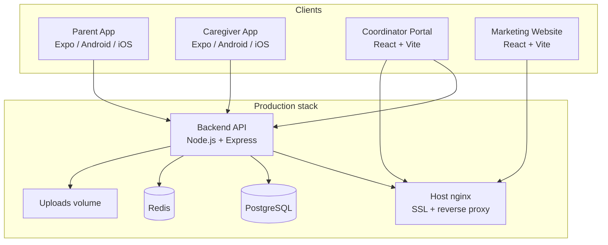

# ChildCare

**ChildCare** is a childcare marketplace for India. Parents discover and book verified caregivers; coordinators onboard and verify caregivers; caregivers manage schedules, time tracking, and earnings through a dedicated mobile app.

This monorepo contains the full product stack: REST API, coordinator web portal, two Expo mobile apps (Parent + Caregiver), and production Docker deployment.

---

## Table of contents

1. [Architecture](#architecture)
2. [User roles & flows](#user-roles--flows)
3. [Monorepo structure](#monorepo-structure)
4. [Backend API](#backend-api)
5. [Coordinator portal (web)](#coordinator-portal-web)
6. [Parent app (mobile)](#parent-app-mobile)
7. [Caregiver app (mobile)](#caregiver-app-mobile)
8. [Marketing website](#marketing-website)
9. [Local development setup](#local-development-setup)
10. [Environment variables](#environment-variables)
11. [Production deployment](#production-deployment)
12. [Business rules](#business-rules)
13. [UI & design](#ui--design)

---

## Architecture



| Layer | Technology |
|-------|------------|
| API | Node.js 20, Express 5, Prisma 5, PostgreSQL 16, Redis 7, BullMQ |
| Coordinator portal | React 19, Vite 8, React Router 7, TanStack Query, Tailwind CSS 4 |
| Mobile apps | Expo 54, expo-router 6, React Native 0.81, TanStack Query, Zustand, i18next |
| Auth | JWT access tokens (15m) + refresh tokens (7d), bcrypt passwords |
| Maps & geo | Google Maps / Places / Geocoding APIs |
| KYC | UIDAI Aadhaar offline XML verification |
| SMS | MSG91 or Twilio (care-start OTP to parents) |
| Deploy | Docker Compose + host nginx + Let's Encrypt |

---

## User roles & flows

| Role | ID | How they join | Primary surface |
|------|----|---------------|-----------------|
| **Admin** | 1 | Seeded (`admin@childcare.com`) | Coordinator portal → `/admin` |
| **Coordinator** | 2 | Created by admin or seeded | Coordinator portal |
| **Caregiver** | 3 | Onboarded by coordinator (primary) or self-register (pending review) | Caregiver app |
| **Parent** | 4 | Self-register in mobile app | Parent app |

### Typical journey

1. **Coordinator** logs into the portal and creates a caregiver profile (ID proof, photo, childcare skills, rates, zones, certifications).
2. **Coordinator** verifies the caregiver → status becomes `VERIFIED` (optionally after Aadhaar XML KYC).
3. **Parent** registers, browses verified caregivers, and books **recurring childcare contract** (MONTHLY) or **babysitting session** (SESSION).
4. **Booking options:**
   - **Direct booking** — pick a specific verified caregiver.
   - **Open area request** — nearby caregivers matching skill/zone get notified and race to accept.
5. **Caregiver** confirms; on arrival marks **arrived at home**; verifies **care-start OTP** (SMS to parent).
6. **Caregiver** clocks in/out; booking completes; **parent** leaves a review including **child safety rating** (only after `COMPLETED`).

---

## Monorepo structure

```
childcare/
├── Backend/                    # REST API, Prisma schema, uploads
├── Coordinator/
│   └── onboarding-agent-web/   # Coordinator + admin web portal
├── Parent App/
│   └── house-owner-app/        # Expo app for customers
├── Caregiver/
│   └── servant-app/            # Expo app for staff
├── Staffera_website/           # Marketing site (referenced in docker-compose)
├── deploy/
│   ├── nginx/childcare.conf     # Host nginx template
│   └── scripts/deploy.sh       # One-command production deploy
├── docker-compose.yml          # Production stack
├── .env.production.example     # VPS environment template
└── README.md                   # This file
```

| App | Path | Default dev URL |
|-----|------|-----------------|
| Backend API | `Backend/` | `http://localhost:5000/api/v1` |
| Coordinator portal | `Coordinator/onboarding-agent-web/` | `http://localhost:5173` |
| Parent app | `Parent App/house-owner-app/` | Expo dev server |
| Caregiver app | `Caregiver/servant-app/` | Expo dev server |

---

## Backend API

### Prerequisites

- Node.js 20+
- PostgreSQL 16+
- Redis 7+ (queues / caching)

### Quick start

```bash
cd Backend
cp .env.example .env          # Configure DATABASE_URL, JWT secrets, etc.
npm install
npx prisma db push            # Apply schema
npx prisma generate
node prisma/seed.js           # Roles, admin, coordinator, childcare skills
npm run dev                   # nodemon — or npm start for production mode
```

**Health check:** `GET http://localhost:5000/health`  
**API root:** `GET http://localhost:5000/` → `{ "success": true, "message": "ChildCare API Running" }`

### Default seeded accounts

| Role | Email | Password |
|------|-------|----------|
| Admin | `admin@childcare.com` | `ChildCare@123` |
| Coordinator | `coordinator@childcare.com` | `ChildCare@123` |

Parents register via the app (`POST /api/v1/auth/register-parent`). Caregivers are created by coordinators (`POST /api/v1/coordinator/caregivers`); default onboarding password in the coordinator form is `Caregiver@123` unless changed.

### API route map

All routes are prefixed with `/api/v1`.

#### Authentication — `/auth`

| Method | Path | Auth | Description |
|--------|------|------|-------------|
| POST | `/register-parent` | — | Parent signup |
| POST | `/register-caregiver` | — | Self-registration (pending coordinator review) |
| POST | `/login` | — | Email/password login |
| POST | `/refresh` | — | Refresh access token |
| POST | `/logout` | Bearer | Invalidate refresh token |
| GET | `/me` | Bearer | Current user profile |
| PATCH | `/me/location` | Bearer | Update user location |
| PATCH | `/me/preferences` | Bearer | Language & preferences |
| POST | `/forgot-password` | — | Password reset email |
| POST | `/reset-password` | — | Reset with token |

#### Caregivers — `/caregivers`

| Method | Path | Role | Description |
|--------|------|------|-------------|
| GET | `/` | PARENT | List verified caregivers (browse; filter by age range, certs, max children) |
| GET | `/me` | CAREGIVER | Own profile |
| PATCH | `/me` | CAREGIVER | Update own profile |
| GET | `/me/schedule` | CAREGIVER | Upcoming bookings |
| GET | `/me/time-entries` | CAREGIVER | Time entry history |
| GET | `/:id` | Any authenticated | Caregiver detail |

#### Bookings — `/bookings`

| Method | Path | Role | Description |
|--------|------|------|-------------|
| POST | `/` | PARENT | Create booking (direct or open area) |
| GET | `/` | Any | List own bookings |
| GET | `/open-requests` | CAREGIVER | Pending area requests in caregiver's zones |
| GET | `/:id` | Any | Booking detail |
| GET | `/:id/tracking` | Any | Live caregiver location for active booking |
| POST | `/:id/tracking` | CAREGIVER | Push GPS updates |
| PATCH | `/:id/confirm` | CAREGIVER | Accept booking |
| PATCH | `/:id/reject` | CAREGIVER | Reject with reason |
| PATCH | `/:id/arrived` | CAREGIVER | Arrived at home |
| POST | `/:id/verify-work-otp` | CAREGIVER | Verify care-start OTP |
| POST | `/:id/resend-work-otp` | CAREGIVER | Resend OTP SMS |
| PATCH | `/:id/cancel` | PARENT | Cancel booking |
| PATCH | `/:id/complete` | Any | Mark completed |
| POST | `/:id/review` | PARENT | Rate completed booking (incl. child safety rating) |

**Booking types:** `MONTHLY` (recurring contract) or `SESSION` (one-off slots).  
**Booking statuses:** `PENDING` → `CONFIRMED` → `ARRIVED` → `OTP_PENDING` → `ACTIVE` → `COMPLETED` (or `CANCELLED` / `REJECTED` / `EXPIRED`).

#### Coordinator — `/coordinator` (COORDINATOR or ADMIN)

| Method | Path | Description |
|--------|------|-------------|
| GET | `/stats` | Dashboard metrics |
| PATCH | `/profile` | Agency name, location, service radius |
| POST | `/caregivers` | Onboard caregiver (multipart: photo + ID proof) |
| GET | `/caregivers` | List onboarded caregivers |
| GET | `/caregivers/:id` | Caregiver detail |
| PATCH | `/caregivers/:id` | Update caregiver |
| PATCH | `/caregivers/:id/password` | Set caregiver login password |
| PATCH | `/caregivers/:id/verify` | Approve/reject verification |
| POST | `/caregivers/:id/upload-id` | Upload ID proof |
| GET/POST/PATCH/DELETE | `/caregivers/:id/zones` | Manage service zones |

#### Admin — `/admin` (ADMIN only)

| Method | Path | Description |
|--------|------|-------------|
| GET | `/stats` | Platform overview |
| GET | `/users` | All users |
| PATCH | `/users/:id/toggle` | Enable/disable user |
| GET | `/bookings` | All bookings |
| GET | `/caregivers` | All caregivers |
| GET/POST/PATCH | `/coordinators` | Manage coordinators |
| GET/POST/PATCH/DELETE | `/skills` | Skill catalog |

#### Other routes

| Prefix | Description |
|--------|-------------|
| `/skills` | Public skill list for forms |
| `/time` | Caregiver clock-in/out, today/month/history |
| `/zones` | Caregiver's own zones (`GET /me`) |
| `/geo` | Places autocomplete, reverse geocode, map preview |
| `/kyc` | Aadhaar offline XML upload & verification |
| `/notifications` | In-app notifications list & read state |

### Database models (Prisma)

Core entities: `User`, `Role`, `Parent`, `Caregiver`, `Coordinator`, `Booking`, `TimeEntry`, `Review`, `Zone`, `Skill`, `CaregiverSkill`, `Notification`, `BookingWorkStartOtp`, `RefreshToken`.

Key enums:

- `VerificationStatus`: `PENDING` | `UNDER_REVIEW` | `VERIFIED` | `REJECTED`
- `BookingType`: `MONTHLY` | `SESSION`
- `BookingStatus`: `PENDING` | `CONFIRMED` | `ACTIVE` | `COMPLETED` | `CANCELLED` | `REJECTED` | `EXPIRED` | `OTP_PENDING` | `ARRIVED`

Schema file: `Backend/prisma/schema.prisma`

### File uploads

Coordinator-uploaded ID proofs and profile photos are stored under `Backend/uploads/` (or `UPLOAD_DIR`). The database stores paths like `/uploads/<filename>`. Files are served at `GET /uploads/<filename>` with cross-origin headers for the agent portal and mobile apps.

### NPM scripts

```bash
npm start              # Production server
npm run dev            # nodemon with hot reload
npm run seed           # Seed roles, admin, agent, skills
npm run seed:servants  # Additional servant test data
```

---

## Coordinator onboarding portal (web)

React SPA for field agents and platform admins to onboard servants, manage verification, and oversee operations.

### Stack

- React 19 + Vite 8
- React Router 7 (nested layouts)
- TanStack Query (server state)
- React Hook Form + Zod validation
- Tailwind CSS 4
- Axios HTTP client

### Local setup

```bash
cd Coordinator/onboarding-agent-web
cp .env.example .env
npm install
npm run dev
```

Open `http://localhost:5173`. Login with `agent@childcare.com` / `ChildCare@123`.

Set `VITE_API_BASE_URL=http://localhost:5000/api/v1` in `.env`. Upload images load from the API origin (`/uploads/...`).

### Routes & features

| Path | Role | Feature |
|------|------|---------|
| `/login` | — | Coordinator/admin login |
| `/` | AGENT, ADMIN | Dashboard with stats |
| `/registrations` | AGENT, ADMIN | Self-registered servants pending review |
| `/servants` | AGENT, ADMIN | Caregiver list |
| `/servants/new` | AGENT, ADMIN | Onboard new servant (photo, ID, skills, rates) |
| `/servants/:id` | AGENT, ADMIN | Caregiver detail & verification |
| `/servants/:id/edit` | AGENT, ADMIN | Edit servant profile |
| `/profile` | AGENT, ADMIN | Coordinator agency profile & service radius |
| `/admin` | ADMIN | Admin dashboard |
| `/admin/agents` | ADMIN | Create/edit agents |
| `/admin/users` | ADMIN | User management |
| `/admin/bookings` | ADMIN | All bookings |
| `/admin/servants` | ADMIN | All servants |
| `/admin/skills` | ADMIN | Skill catalog CRUD |

### Build for production

```bash
npm run build    # Output in dist/
npm run preview  # Local preview of production build
```

Docker image is built via `Coordinator/onboarding-agent-web/Dockerfile` (nginx serves static files).

---

## Parent app (mobile)

Expo app for house owners to browse staff, request bookings, track live location, verify work-start OTP, and leave reviews.

### Stack

- Expo SDK 54, expo-router 6
- React Native 0.81, React 19
- TanStack Query, Zustand, Axios
- react-native-maps + Google Maps
- i18next (English, Hindi, Marathi)
- expo-secure-store (token storage)
- expo-location (address picker)

### Local setup

```bash
cd "Parent App/house-owner-app"
cp .env.example .env
npm install
npx expo install
npm start
```

Press `a` for Android emulator, `i` for iOS simulator, or scan QR with Expo Go / dev build.

**Physical device:** use your PC's LAN IP in `EXPO_PUBLIC_API_BASE_URL`, not `localhost`:

```bash
# Windows: ipconfig → IPv4 Address
EXPO_PUBLIC_API_BASE_URL=http://localhost:5000/api/v1
```

After changing `.env`, restart with `npx expo start -c`.

### App screens (expo-router)

| Tab / Screen | Path | Description |
|--------------|------|-------------|
| Home | `(main)/home` | Dashboard, quick actions |
| Browse | `(main)/browse` | Search verified servants by skill |
| Caregiver detail | `(main)/browse/[id]` | Profile, rates, book CTA |
| Bookings | `(main)/bookings` | Active & past bookings |
| New booking | `(main)/bookings/new` | Monthly or session request |
| Booking detail | `(main)/bookings/[id]` | Status, live map, work-start OTP card |
| Profile | `(main)/profile` | Account, address, language |
| Notifications | `(main)/notifications` | In-app alerts |
| Login / Register | `(auth)/login`, `(auth)/register` | Auth flows |

### Release builds (EAS)

```bash
npm run eas:env:push              # Push .env to EAS preview
npm run eas:env:push:production   # Push .env to EAS production
npm run build:apk                 # Android APK (preview profile)
```

Configure `eas.json` and Expo project ID before cloud builds. For production APKs set:

```bash
EXPO_PUBLIC_API_BASE_URL=https://api.yourdomain.com/api/v1
```

---

## Caregiver app (mobile)

Expo app for onboarded staff to view schedules, accept open area requests, track time, share live location, verify Aadhaar, and view earnings.

### Stack

Same core as Parent app, plus:

- expo-notifications (booking request alerts)
- expo-haptics (pending request vibration)
- expo-document-picker (Aadhaar ZIP upload)

### Local setup

```bash
cd Caregiver/servant-app
cp .env.example .env
npm install
npx expo install
npm start
```

**Important:** Caregivers cannot use the app until an agent creates their account in the portal. Login uses the email/password set during onboarding.

For native Android builds with maps:

```bash
npm run android    # expo run:android (dev client)
```

### App screens

| Tab / Screen | Path | Description |
|--------------|------|-------------|
| Home | `(main)/home` | Today's overview, open requests |
| Schedule | `(main)/schedule` | Upcoming & active bookings |
| Booking detail | `(main)/schedule/[id]` | Accept/reject, navigate, arrived, OTP |
| Time | `(main)/time` | Clock in/out for active booking |
| Time history | `(main)/time/history` | Past time entries |
| Earnings | `(main)/earnings` | Income summary |
| Profile | `(main)/profile` | Rates, availability, bank details |
| Aadhaar verify | `(main)/profile/verify-aadhaar` | Upload UIDAI offline XML |
| Zones | `(main)/zones` | Service area management |
| Notifications | `(main)/notifications` | Job alerts |
| Login | `(auth)/login` | Caregiver login (no self-signup primary flow) |

### Alerts

The app polls for open booking requests and triggers vibration + notifications when new area jobs match the servant's zones and skills.

---

## Marketing website

The production Docker stack includes a `Staffera_website` service (port `15001`) — a Vite marketing site with links to app stores and the agent portal. Add or clone the site into `Staffera_website/` before running `docker compose up` if that folder is not yet in your checkout.

Build args (from `.env.production.example`):

- `VITE_HOUSE_OWNER_APP_URL`, `VITE_SERVANT_APP_URL`
- `VITE_AGENT_PORTAL_URL`
- `VITE_PLAY_STORE_*`, `VITE_APP_STORE_*`

---

## Local development setup

### Full stack (recommended order)

1. **PostgreSQL & Redis** — install locally or use Docker:

   ```bash
   docker run -d --name childcare-pg -e POSTGRES_PASSWORD=password -e POSTGRES_DB=childcare -p 5432:5432 postgres:16-alpine
   docker run -d --name childcare-redis -p 6379:6379 redis:7-alpine
   ```

2. **Backend** — see [Backend API](#backend-api) quick start.

3. **Coordinator portal** — see [Coordinator portal](#agent-onboarding-portal-web).

4. **Mobile apps** — see respective sections. Point both apps at the same API URL.

### Google Maps (all clients)

Use the **same API key** on backend and both mobile apps, plus a **Map ID** from [Google Cloud Map Management](https://console.cloud.google.com/google/maps-apis):

```bash
# Backend/.env
GOOGLE_MAPS_API_KEY=your_key
GOOGLE_MAP_ID=your_map_id

# Both mobile app/.env
EXPO_PUBLIC_GOOGLE_MAPS_API_KEY=your_key
EXPO_PUBLIC_GOOGLE_MAP_ID=your_map_id
```

Enable in Google Cloud Console: **Places API**, **Geocoding API**, **Maps SDK for Android**, **Maps SDK for iOS**. Restrict keys by API in production. After `.env` changes, restart the backend and run `npx expo start -c`.

### Aadhaar KYC (optional)

Download the UIDAI offline public key to `Backend/certs/` (see `Backend/certs/README.md`). Set `UIDAI_OFFLINE_CERT_PATH` in backend `.env`. When `REQUIRE_AADHAAR_VERIFICATION=true`, house owners only see servants with `aadhaarVerified=true`.

### SMS / work-start OTP

For development, set `SMS_PROVIDER=log` and `SMS_ALLOW_DEV_OTP=true` — OTP appears in API responses. For production in India, use `SMS_PROVIDER=msg91` with DLT template.

---

## Environment variables

### Backend (`Backend/.env`)

| Variable | Required | Description |
|----------|----------|-------------|
| `DATABASE_URL` | Yes | PostgreSQL connection string |
| `JWT_SECRET` | Yes | Min 32 chars |
| `JWT_REFRESH_SECRET` | Yes | Min 32 chars |
| `REDIS_URL` | Yes | Redis for queues |
| `CLIENT_URL` | Dev | Comma-separated CORS origins |
| `GOOGLE_MAPS_API_KEY` | Maps | Places, geocoding, static maps |
| `GOOGLE_MAP_ID` | Optional | Styled map tiles |
| `UPLOAD_DIR` | Optional | Default `uploads` |
| `SMS_PROVIDER` | OTP | `log` \| `msg91` \| `twilio` |
| `REQUIRE_AADHAAR_VERIFICATION` | Optional | Default `true` |
| `SERVANT_AGENT_RADIUS_KM` | Optional | Coordinator proximity radius (default 3) |
| `FCM_SERVER_KEY` | Optional | Push notifications |
| `SMTP_*` | Optional | Email (password reset) |

See `Backend/.env.example` for the full list.

### Coordinator portal (`Coordinator/onboarding-agent-web/.env`)

| Variable | Description |
|----------|-------------|
| `VITE_API_BASE_URL` | API URL including `/api/v1` |
| `VITE_API_HOST` | Optional override for `/uploads` origin |

### Mobile apps (both `.env`)

| Variable | Description |
|----------|-------------|
| `EXPO_PUBLIC_API_BASE_URL` | API URL including `/api/v1` |
| `EXPO_PUBLIC_GOOGLE_MAPS_API_KEY` | Native map tiles |
| `EXPO_PUBLIC_GOOGLE_MAP_ID` | Optional styled maps |
| `EXPO_PUBLIC_USE_GOOGLE_MAP_ID` | Set `true` only when Map ID works on mobile SDKs |

---

## Production deployment

ChildCare runs as **five Docker containers**: PostgreSQL, Redis, API, marketing website, and agent portal. Containers bind to **localhost only** so your VPS nginx reverse-proxies alongside other apps.

### 1. Prepare the VPS

```bash
git clone <repo-url> childcare && cd childcare
cp .env.production.example .env
# Edit .env: domains, JWT secrets, POSTGRES_PASSWORD, Google Maps, SMS, etc.
bash deploy/scripts/deploy.sh
```

Optional first-time seed:

```bash
docker compose --env-file .env exec api node prisma/seed.js
```

### 2. Host nginx

Copy `deploy/nginx/childcare.conf` to `/etc/nginx/sites-available/`, replace `childcare.example.com` with your domains, adjust upstream ports if you changed `CHILDCARE_*_PORT` in `.env`, then enable and reload nginx.

Default localhost upstream ports:

| Service | Port |
|---------|------|
| API | 15000 |
| Website | 15001 |
| Coordinator portal | 15002 |

### 3. DNS records

| Host | Points to |
|------|-----------|
| `childcare.example.com` | Marketing site |
| `coordinator.childcare.example.com` | Coordinator portal |
| `api.childcare.example.com` | Backend API + `/uploads` |

### 4. Mobile production builds

Before EAS/release builds:

```bash
EXPO_PUBLIC_API_BASE_URL=https://api.childcare.example.com/api/v1
```

### Production checklist

- [ ] Strong `JWT_SECRET` and `JWT_REFRESH_SECRET` (32+ chars)
- [ ] `SMS_ALLOW_DEV_OTP=false`
- [ ] `SMS_PROVIDER=msg91` (or Twilio) with DLT template
- [ ] Google Maps API keys restricted by API + app package
- [ ] `CLIENT_URL` lists only your real web origins
- [ ] SSL via Let's Encrypt (`certbot` instructions in nginx config)
- [ ] `uploads` Docker volume backed up

---

## Business rules

- **Caregivers cannot self-register as verified** — primary onboarding is coordinator-only via `POST /api/v1/coordinator/caregivers`. Self-registration creates a `PENDING` profile for coordinator review.
- **Browse lists only `VERIFIED` caregivers** — parents do not see pending or rejected profiles.
- **Caregiver profiles** must include age range(s) served, max children, and CPR/first-aid certification flags.
- **Parent profiles** include number of children, children ages, and special requirements.
- **Browse filters** — parents can filter by age range served, certification, and max children.
- **Aadhaar gate** — when `REQUIRE_AADHAAR_VERIFICATION=true`, only Aadhaar-verified caregivers appear in browse (configurable).
- **Booking conflict checks** run inside Prisma transactions to prevent double-booking.
- **Open area requests** require parent GPS; caregivers must cover the location via zones/skills to see the request.
- **Care-start OTP** — SMS sent to the parent's registered mobile; caregiver must verify before care is marked active.
- **Reviews** are allowed only after booking status is `COMPLETED`, and must include a **child safety rating** (1–5) plus overall rating.
- **Coordinator service radius** — caregivers are routed to coordinators within `CAREGIVER_COORDINATOR_RADIUS_KM` (default 3 km; admin can set per coordinator).

---

## UI & design

Design reference: `stitch_childcare_premium_service_app/` (see `premium_service_logic/DESIGN.md` if present).

**Brand tokens** (shared across apps via `Stitch` theme):

| Token | Value | Usage |
|-------|-------|-------|
| Primary | `#1B6CA8` | Trust blue — headers, healthcare trust |
| Secondary | `#2CA58D` | Teal-green — growth, care |
| CTA gradient | `#1B6CA8 → #2CA58D` | Primary buttons |
| Surface | Warm off-white | Cards, backgrounds |

**Patterns:** glass cards, ₹ pricing, verified badges, bilingual UI (EN / HI / MR) — tuned for Indian families seeking trusted childcare.

---

## Troubleshooting

| Issue | Fix |
|-------|-----|
| Port 5000 in use | `netstat -ano \| findstr :5000` then `taskkill /PID <pid> /F` (Windows) |
| Mobile app can't reach API | Use LAN IP, same Wi‑Fi, firewall allows port 5000 |
| Map tiles 403 | Check Map ID is enabled for Android/iOS SDKs; or unset `EXPO_PUBLIC_USE_GOOGLE_MAP_ID` |
| Caregiver can't log in | Account must exist from agent portal first |
| Upload images broken in agent portal | Set `VITE_API_BASE_URL` and ensure backend serves `/uploads` |
| OTP not received | Use `SMS_PROVIDER=log` in dev; check MSG91/Twilio creds in prod |

---

## License

Private / proprietary — all rights reserved unless otherwise stated in the repository.
